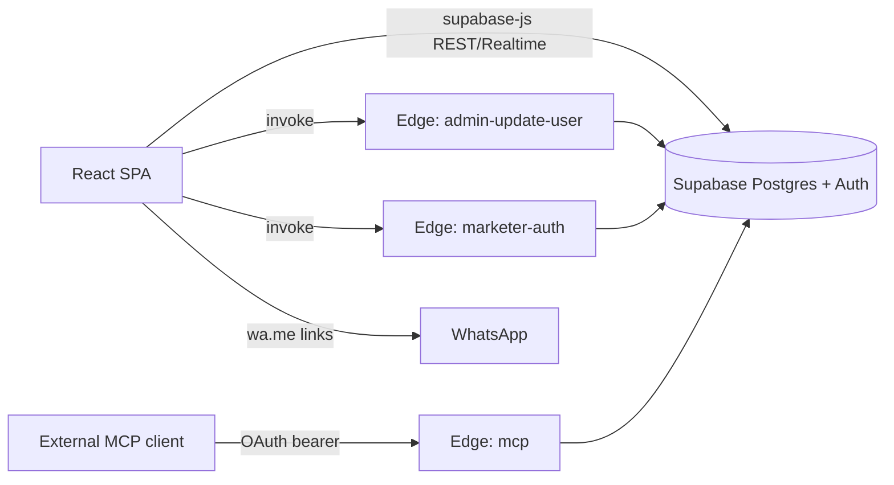
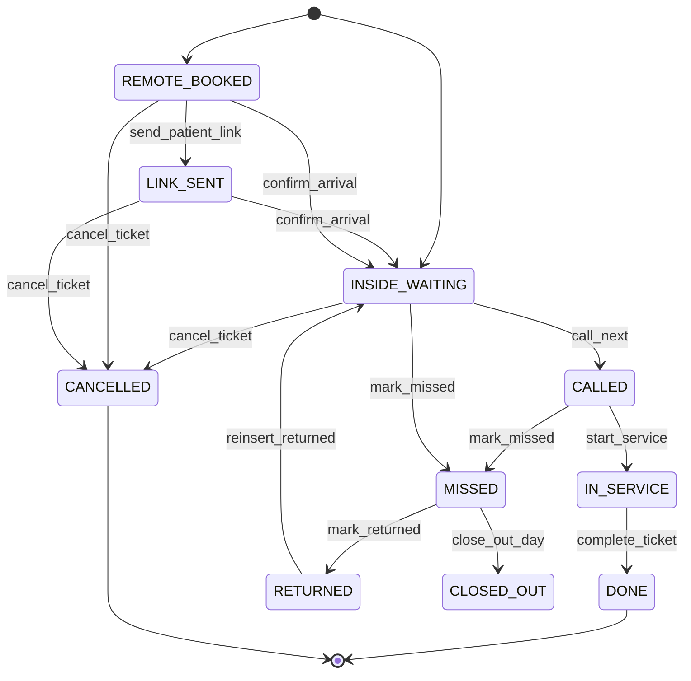

# inddd QueueLine — Project Documentation

## 1. Project Overview

- **Product purpose:** MVP clinic queue-management system for Egyptian clinics. Patients receive a queue link, receptionists manage the live queue, and marketers/admins run the commercial side.
- **Main user roles:** Super Admin, Marketer, Clinic Owner / Admin / Secretary (clinic staff), Doctor (enum only), Patient (link-based, no login), Public visitor.
- **Current implemented scope:** Clinic onboarding with referral-code gating, live queue console (create / call / start / complete / miss / return / cancel / urgent / insert), public patient tracking page with anchored ETA, super-admin portal (clinic approvals, marketer management, user management, analytics stub), marketer portal (leads + registered clinics view), Arabic RTL marketing home + doctor directory (SEO), MCP server exposing 3 tools over OAuth.
- **Technology stack:** React 18 + Vite 5 + TypeScript 5, Tailwind CSS 3, shadcn/ui (Radix), react-router-dom v6, @tanstack/react-query, react-hook-form + zod, sonner, lucide-react, react-helmet-async, `@supabase/supabase-js` 2, `@lovable.dev/mcp-js` 0.24, `@lovable.dev/cloud-auth-js` 1. Backend: Supabase (Postgres + Auth + Edge Functions) via Lovable Cloud. Testing: Vitest + jsdom.
- **Current project status:** Working MVP. Strictly Arabic UI (RTL). No SMS/WhatsApp API integrations — outreach is via `wa.me` links. No payment provider is wired. Analytics page is a placeholder shell. Doctor role is defined but not surfaced as a distinct experience.

## 2. Architecture

- **Frontend:** SPA served by Vite. Routing in `src/App.tsx` with `BrowserRouter`. Global providers: `QueryClientProvider`, `TooltipProvider`, `Toaster` (shadcn), `Sonner`, `AuthProvider`. Route guards: `ProtectedRoute`, `SuperAdminRoute`, `MarketerProtectedRoute`. Locale layer in `src/i18n/` is Arabic-only.
- **Backend:** Supabase Postgres. Business logic lives in `SECURITY DEFINER` SQL RPCs (see §8). Three Edge Functions: `admin-update-user`, `marketer-auth`, `mcp` (auto-generated).
- **Database & authentication:** Supabase Auth (email/password). Roles stored in a dedicated `user_roles` table, never on profiles. Marketers use synthetic emails (`mkt_<code>@inddd.local`) minted by the `marketer-auth` function.
- **Realtime:** The console subscribes to ticket changes via `supabase.channel` in `useClinicTickets` (`Realtime`-based reactive queue). Patient page uses polling + a client-side countdown; realtime subscription not verified for the patient view.
- **External services:** WhatsApp (via `wa.me` deep links only — no API). Google Maps (embed URL for clinic location). No SMS/email vendor is wired beyond Supabase Auth mails.
- **Main data flow:**
  1. Clinic staff authenticates → `useAuth` loads roles + clinic status.
  2. Staff opens `/console` → `useClinicTickets(clinicId)` selects tickets for today and subscribes to realtime updates.
  3. Actions call `SECURITY DEFINER` RPCs (`create_ticket`, `call_next`, `start_service`, `complete_ticket`, `mark_missed`, `mark_returned`, `send_patient_link`, `confirm_arrival`, `cancel_ticket`, `set_urgent_and_insert`, `reinsert_returned`).
  4. `send_patient_link` (or ticket creation) issues a row in `patient_links` with a random `token`; that token drives `/q/:token`.
  5. Public page calls `get_patient_queue_view(p_token)` which returns a `patient_queue_view` composite (position, ETA window, ahead counts, clinic name/coords).
- **Architectural decisions:**
  - All state transitions are server-authoritative through RPCs; the client never mutates ticket rows directly.
  - Timezone is per-clinic; `get_patient_queue_view` and rate-calc RPCs derive "today" from the clinic timezone (`Africa/Cairo` by default).
  - MCP tools use the caller's Supabase JWT so RLS applies per tool call.
  - No service-role key is used in client code.



## 3. Repository Structure

- `src/App.tsx` — route table + providers.
- `src/main.tsx` — React root.
- `src/pages/` — top-level route components.
  - `MarketingHome.tsx`, `Directory/*` — public site (Arabic).
  - `Legal/*` — privacy, terms, contact.
  - `Login.tsx` — clinic sign-in / sign-up (referral-gated).
  - `ClinicOnboarding.tsx` — draft/pending clinic wizard.
  - `ClinicProfile.tsx`, `QueueSettings.tsx` — clinic settings.
  - `Console.tsx` — receptionist queue console.
  - `PatientQueue.tsx` — public tracking page (`/q/:token`).
  - `Index.tsx` — legacy `/app` landing.
  - `OwnerPortal/*` — super-admin pages.
  - `Marketer/*` — marketer portal.
  - `OAuthConsent.tsx` — MCP OAuth consent screen.
  - `NotFound.tsx`.
- `src/components/` — grouped by domain: `console/`, `admin/`, `marketer/`, `marketing/`, `clinic/`, `inputs/`, `seo/`, `ui/` (shadcn primitives).
- `src/hooks/` — `useAuth`, `useClinicTickets`, `useTicketActions`, `useTicketHighlight`, `use-mobile`, `use-toast`.
- `src/config/navItems.ts`, `src/config/publicBaseUrl.ts` — shared configuration.
- `src/data/directory.ts` — static specialties/cities used by the marketing directory.
- `src/i18n/` — locale (Arabic only), path helpers.
- `src/utils/` — `phoneEG.ts`, `ticketSource.ts`, `chimeSound.ts`.
- `src/integrations/supabase/` — generated `client.ts` and `types.ts` (do not edit).
- `src/integrations/lovable/` — generated Lovable Cloud auth wrapper.
- `src/lib/mcp/` — MCP server entry + tools (`index.ts`, `tools/list-tickets.ts`, `tools/call-next.ts`, `tools/clinic-info.ts`).
- `supabase/migrations/` — 24 SQL migrations (schema, RPCs, RLS, seeds).
- `supabase/functions/admin-update-user/`, `supabase/functions/marketer-auth/` — hand-written Edge Functions.
- `supabase/functions/mcp/index.ts` — auto-generated by the MCP Vite plugin (do not edit).
- `supabase/config.toml` — project + per-function overrides.
- `.lovable/mcp/manifest.json` — MCP manifest emitted by the extractor.
- `public/` — static assets (`robots.txt`, `sitemap.xml`, placeholders).
- `data/` — CSV seeds for Egypt geo and specialties.
- `docs/brand-ui.md` — brand notes.

## 4. Application Routes and Pages

| Path | Component | Role | Purpose | Auth | Main actions | Data touched | Status |
|---|---|---|---|---|---|---|---|
| `/` | `MarketingHome` | Public | Arabic landing, hero search, specialty grid, FAQ. | None | Navigate to directory, CTAs. | Static (`data/directory.ts`). | Implemented |
| `/app` | `Index` | Any | Legacy landing card (Not verified as linked from UI). | None | Redirects to marketing pieces. | — | Implemented (legacy) |
| `/login` | `Login` | Clinic | Sign-in + sign-up with referral code validation. | Public | `signIn`, `signUp` (Supabase), `validate_referral_code`. | `auth.users`, `marketers`. | Implemented |
| `/onboarding` | `ClinicOnboarding` | Clinic (any auth user) | Draft/pending clinic wizard; blocks until approval. | Required (`skipOnboardingCheck`, `skipProfileCheck`) | `onboard_clinic`, geo pickers. | `clinics`, `user_roles`. | Implemented |
| `/clinic-profile` | `ClinicProfile` | Owner/Admin | Complete/edit clinic profile. | Required (`skipProfileCheck`) | `clinics` update, WhatsApp phones. | `clinics`. | Implemented |
| `/queue-settings` | `QueueSettings` | Owner/Admin | Working hours, avg service time, urgent/pause flags. | Required + active + profile complete | Update `clinics` config. | `clinics`. | Implemented |
| `/console` | `Console` | Owner/Admin/Secretary | Live queue console. | Required | Create/call/start/complete/miss/return/cancel/urgent/insert ticket, send link, pause, close intake. | `tickets`, `patient_links`, RPCs. | Implemented |
| `/q/:token` | `PatientQueue` | Patient | Public queue tracking page. | None (token) | Confirm arrival (client → RPC), open maps, WhatsApp link. | `get_patient_queue_view`, `confirm_arrival`. | Implemented |
| `/doctors` | `DoctorsIndex` | Public | Directory root. | None | Browse specialties. | Static seeds. | Implemented (SEO scaffolding) |
| `/doctors/:specialty` | `DoctorsSpecialty` | Public | Specialty page. | None | Browse cities. | Static seeds. | Implemented |
| `/doctors/:specialty/:city` | `DoctorsCity` | Public | City page. | None | Browse areas. | Static seeds. | Implemented |
| `/doctors/:specialty/:city/:area` | `DoctorsArea` | Public | Area page. | None | Not verified: no actual doctor listing data source is wired. | Static seeds. | UI only |
| `/privacy`, `/terms`, `/contact` | `Legal/*` | Public | Legal pages. | None | Read-only. | — | Implemented |
| `/m` | `MarketerLogin` | Marketer | Login by referral code + password. | Public | `marketer-auth` edge function. | `marketers`, `auth.users`. | Implemented |
| `/m/dashboard` | `MarketerDashboard` | Marketer | Leads pipeline + registered clinics. | Required marketer | `get_marketer_pipeline`, `get_my_marketer_crm`, lead CRUD. | `marketer_leads`, `clinics`, `commissions`. | Implemented |
| `/m/settings` | `MarketerSettings` | Marketer | Marketer self-service. | Required marketer | Update password, target areas. | `marketers`, `marketer_target_areas`. | Partially implemented (Not verified end-to-end) |
| `/ad/login` | `OwnerLogin` | Super Admin | Admin login. | Public | Supabase sign-in + superadmin check. | `user_roles`. | Implemented |
| `/ad` | `OwnerDashboard` | Super Admin | Admin home cards. | Required superadmin | Navigate to sub-pages. | — | Implemented |
| `/ad/marketers` | `MarketerManagement` | Super Admin | Manage marketers. | Required superadmin | Create/toggle/reset marketer. | `marketers`, `commissions`. | Implemented |
| `/ad/marketers/:id` | `MarketerProfile` | Super Admin | Marketer profile & HR ledger. | Required superadmin | Ledger, payroll, commissions. | `marketer_ledger`, `marketer_attendance`, `commissions`. | Partially implemented — payroll engine present in memory notes; UI wiring Not verified. |
| `/ad/approvals` | `ClinicApprovals` | Super Admin | Approve / block clinics, view details. | Required superadmin | `approve_clinic`, `suspend_clinic`, `delete_clinic`. | `clinics`, `audit_log`. | Implemented |
| `/ad/analytics` | `OwnerAnalytics` | Super Admin | Analytics screen. | Required superadmin | Not verified — mostly a placeholder shell. | Read-only. | UI only |
| `/ad/users` | `UserManagement` | Super Admin | Reset passwords for auth + marketer users. | Required superadmin | `admin-update-user`, `marketer-auth`. | `auth.users`, `marketers`. | Implemented |
| `/.lovable/oauth/consent` | `OAuthConsent` | Any authed user | MCP OAuth consent screen. | Requires session (redirects to `/login?next=…`). | Approve/deny authorization via `supabase.auth.oauth`. | Supabase Auth OAuth server. | Implemented |
| `*` | `NotFound` | Public | 404. | None | — | — | Implemented |

## 5. User Roles and Permissions

Roles come from `public.app_role` enum: `owner`, `admin`, `secretary`, `doctor`, `superadmin`. Rows live in `public.user_roles(user_id, role, clinic_id)`. Marketers are represented by a row in `marketers` linked to an auth user via `marketer_users`; there is no `app_role` for them.

- **Super Admin:** Checked via `is_superadmin(_user_id)` and `SuperAdminRoute`. Can approve/suspend/delete clinics, reset passwords (edge functions), manage marketers, view all data (RLS policies grant broad access).
- **Clinic Owner / Admin:** Own their clinic. `has_role`, `is_clinic_owner_or_admin`, and `is_clinic_member` gate DB access. Full RPC set for queue operations + clinic profile / queue settings.
- **Secretary:** Clinic staff. Same queue RPCs as owner/admin per RPC checks; profile/queue-settings edits Not verified for this role (RLS policies grant SELECT/UPDATE on `clinics` to clinic members — exact write scope Not verified).
- **Doctor:** Enum value only. No dedicated UI or RPC surface in the current code.
- **Patient:** No login. Access is bearer-token style through `patient_links.token`. `get_patient_queue_view(p_token)` is `SECURITY DEFINER` and callable by `anon`.
- **Marketer:** Authenticated with synthetic email via `marketer-auth`. Access to own leads (`marketer_leads`), own ledger/attendance (`marketer_ledger`, `marketer_attendance`), and a read-only view of clinics they onboarded through `get_marketer_pipeline` / `get_my_marketer_crm`.
- **Public visitor:** Marketing home, directory, legal pages, patient queue via token.

Front-end guards mirror these: `ProtectedRoute` checks `user` → `clinicId` → `clinicStatus` (`active`) → `profileComplete`. `SuperAdminRoute` requires a `superadmin` row in `user_roles`. `MarketerProtectedRoute` reads a client-side marketer session token from localStorage/state (Not verified — see security section).

## 6. Core Features

| Feature | Status | Notes |
|---|---|---|
| Clinic onboarding | Implemented | `onboard_clinic` RPC; draft → pending → active lifecycle. |
| Clinic profile management | Implemented | `ClinicProfile.tsx` + `ClinicProfileForm.tsx`; WhatsApp phones (E.164) validated by `EgyptPhoneInput`. |
| Authentication | Implemented | Email/password only. Social sign-in removed (memory: `mem://auth/authentication-methods`). |
| Queue sessions (pause / close intake) | Implemented | `set_session_paused`, `set_intake_open`, `close_out_day`. |
| Ticket creation (normal / scheduled / urgent) | Implemented | `create_ticket` overloaded RPC handles source (`EXTERNAL`, `PHONE_CALL`, `WALK_IN`), type (`NORMAL`, `SCHEDULED`, `URGENT`), visit type. |
| Normal bookings | Implemented | Rank-key based insertion (memory: `mem://architecture/queue-engine`). |
| Scheduled bookings | Implemented | Uses `appointment_time` + late demotion rule. |
| Urgent bookings | Implemented | `set_urgent_and_insert` with restricted `insert_position` options. |
| Patient arrival confirmation | Implemented | `confirm_arrival` RPC callable by anon-with-token path from `/q/:token`. |
| Queue status transitions | Implemented | Enum + `SECURITY DEFINER` RPCs enforce transitions. |
| Call next patient | Implemented | `call_next` RPC + console button + `useTicketHighlight`. |
| Consultation start & completion | Implemented | `start_service`, `complete_ticket`. |
| Missed patients | Implemented | `mark_missed`; tracked with `miss_count`. |
| Returned patients | Implemented | `mark_returned` + `reinsert_returned`. |
| Deferred/cancelled visits | Implemented | `cancel_ticket`. |
| Pause and resume | Implemented | `set_session_paused` flag + patient page shows paused banner. |
| Patient queue links | Implemented | `send_patient_link` mints a row in `patient_links`; partial unique index enforces one active link per ticket. |
| Link expiration/regeneration | Implemented | `valid_until` and `revoked_at`; regeneration via `send_patient_link`. |
| ETA / waiting-time calculation | Implemented | `get_patient_queue_view` returns anchored ETA window + weighted pre-arrival load using `remote_showup_rate` (memory: `mem://architecture/queue-engine/eta-calculation-logic`). |
| WhatsApp sharing | Implemented | `wa.me` deep links from console + patient link; no API. |
| Visit history | Not implemented | No history route/view in the code. |
| Reports and analytics | UI only | `OwnerAnalytics.tsx` is a placeholder shell. |
| Patient portal | Implemented | Public `/q/:token` with real-time countdown. Ratings absent. |
| Ratings | Not implemented | No rating UI or table. |
| Clinic directory & search | Partially implemented | Static seed data drives specialty/city/area pages; real doctor listings are not wired. |
| Admin functionality | Implemented | Approvals, marketer management, user password resets, HR ledger scaffolding. |
| Suspension / support page | Implemented | Blocked clinics redirect (memory: `mem://features/suspension-support-workflow`). |
| Doctor role experience | Not implemented | Enum defined; no doctor-specific pages. |
| Payments / billing | Partially implemented | `clinic_payments`, `financial_status`, `next_billing_date`, `log_clinic_payment`, `mark_overdue_clinics` exist. No external payment provider is wired. |
| MCP integrations | Implemented | 3 tools (`list_tickets`, `call_next`, `get_clinic_info`) over OAuth. |

## 7. Queue Engine

- **Ticket types (`ticket_type`):** `SCHEDULED`, `NORMAL`, `URGENT`.
- **Ticket sources (`ticket_source`):** `EXTERNAL` (with `external_booking_app_id` / `_other`), `PHONE_CALL`, `WALK_IN`.
- **Visit types (`visit_type`):** `NEW`, `CONSULTATION`.
- **Ticket statuses (`ticket_status`):** `REMOTE_BOOKED`, `LINK_SENT`, `INSIDE_WAITING`, `CALLED`, `IN_SERVICE`, `DONE`, `MISSED`, `RETURNED`, `CANCELLED`, `CLOSED_OUT`.
- **Allowed transitions (from RPCs and enum semantics):**
  - Create → `REMOTE_BOOKED` (external / phone with future appt) or `INSIDE_WAITING` (walk-in / phone with immediate arrival).
  - `send_patient_link` → `LINK_SENT`.
  - `confirm_arrival` → `INSIDE_WAITING`.
  - `call_next` → `CALLED`.
  - `start_service` → `IN_SERVICE`.
  - `complete_ticket` → `DONE`.
  - `mark_missed` → `MISSED` (increments `miss_count`).
  - `mark_returned` → `RETURNED`, then `reinsert_returned` re-queues with `insert_position` (`AFTER_CURRENT`, `AFTER_N`, `END`) and updated `rank_key`.
  - `set_urgent_and_insert` re-ranks with restricted insert options.
  - `cancel_ticket` → `CANCELLED`.
  - `close_out_day` → remaining tickets → `CLOSED_OUT`.
- **Queue ordering:** `rank_key` numeric with lane bases (`1B` inside, `2B` pre-arrival, `3B` end) — memory `mem://architecture/queue-engine`.
- **Eligibility & scheduled patients:** Scheduled patients demoted to normal lane on late arrival (memory `mem://features/queue-fairness`).
- **Urgent insertion:** Constrained via `InsertPositionDialog` component and RPC-side validation.
- **Missed & returned behavior:** Miss count captured; returned patients require an explicit re-insertion action.
- **Pause / resume:** Global `session_paused` and `intake_open` on `clinics`; RPC guards refuse new tickets when intake is closed.
- **ETA calculation:** `get_patient_queue_view` computes `expected_window_start` / `expected_window_end` anchored to `arrival_confirmed_at` or `appointment_time`, adds inside-lane load + pre-arrival load weighted by `remote_showup_rate`, and returns `eta_min_minutes`, `eta_max_minutes`, `expected_wait_minutes`.
- **End-of-session:** `close_out_day` and the 3 AM cron `mark_overdue_clinics` (memory `mem://architecture/maintenance-automation`).
- **Manual overrides:** `set_urgent_and_insert`, `reinsert_returned`, `cancel_ticket`; UI in console dialogs.



## 8. Database Documentation

Schema: `public`. RLS is enabled on all listed tables (see policy counts in the codebase context). Grants follow the project rule (grants to `authenticated` / `service_role`; `anon` only where required).

| Table | Purpose | Notable columns | PK | Foreign keys (verified) | RLS |
|---|---|---|---|---|---|
| `clinics` | Clinic master record (44 cols). | `name_ar`, `status` (`entity_status`), `financial_status`, `timezone`, `open_time`/`close_time`, `avg_service_minutes`, `remote_showup_rate`, `session_paused`, `intake_open`, `marketer_id`, `primary_specialty_id`, `lat`/`lng`, `serial_id`. | `id` | `marketer_id → marketers.id`, `primary_specialty_id → specialties.id` (Not verified individually). | 5 policies |
| `tickets` | Queue tickets (22 cols). | `clinic_id`, `patient_name`, `patient_phone`, `status`, `type`, `source`, `visit_type`, `appointment_time`, `arrival_confirmed_at`, `called_at`, `service_started_at`, `completed_at`, `rank_key`, `manual_insert_position`, `miss_count`, `external_booking_app_id`. | `id` | `clinic_id → clinics.id`, `external_booking_app_id → external_booking_apps.id`. | 4 policies |
| `patient_links` | One active tracking link per ticket. | `ticket_id`, `clinic_id`, `token`, `valid_until`, `revoked_at`, `last_opened_at`. | `id` | `ticket_id → tickets.id`, `clinic_id → clinics.id`. Partial unique index on active tokens (memory `mem://architecture/link-security`). | 3 policies |
| `user_roles` | Role assignments. | `user_id`, `role` (`app_role`), `clinic_id`. | `id` | `user_id → auth.users`, `clinic_id → clinics.id` (Not verified). | 8 policies |
| `marketers` | Marketer master (20 cols). | `referral_code`, `full_name`, `phone`, `base_salary`, `status`, `region`, HR fields. | `id` | — | 4 policies |
| `marketer_users` | Link auth users to marketer. | `user_id`, `marketer_id`. | `id` | `user_id → auth.users`, `marketer_id → marketers.id`. | 4 policies |
| `marketer_leads` | CRM leads (12 cols). | `marketer_id`, `clinic_name`, `stage`, `lat/lng`, contact info. | `id` | `marketer_id → marketers.id`. | 5 policies |
| `marketer_ledger` | Marketer HR ledger. | `marketer_id`, `tx_type` (`ledger_tx_type`), `amount`, `note`, `related_id`. | `id` | `marketer_id → marketers.id`. | 4 policies |
| `marketer_attendance` | Daily attendance. | `marketer_id`, `date`, `status` (`attendance_status`). | `id` | `marketer_id → marketers.id`. | 4 policies |
| `marketer_target_areas` | Territory targets. | `marketer_id`, geo fields. | `id` | `marketer_id → marketers.id`. | 4 policies |
| `marketer_password_reset_requests` | Reset flow. | `marketer_id`, `token`, `status`. | `id` | `marketer_id → marketers.id`. | 2 policies |
| `commissions` | Marketer commissions. | `marketer_id`, `clinic_id`, `amount`, `status` (Pending Trial → Earned), `earned_date`, `paid_at`. | `id` | `marketer_id → marketers.id`, `clinic_id → clinics.id` (unique on clinic_id). | 4 policies |
| `clinic_payments` | Clinic subscription log. | `clinic_id`, `amount`, `note`, `logged_by`. | `id` | `clinic_id → clinics.id`. | 3 policies |
| `audit_log` | Operational audit. | `clinic_id`, `ticket_id`, `action` (`audit_action`), `actor_id`, `details_json`. | `id` | (Not verified — schema not directly inspected.) | 3 policies |
| `external_booking_apps` | External booking source registry. | `code`, `label_ar`, `is_active`. | `id` | — | 1 policy |
| `geo_localities` | Egypt geo hierarchy seed. | `governorate_ar`, `level2_ar`, `level3_ar`, `level2_type`. | `id` | — | 1 policy |
| `gov_codes` | Governorate → serial-code mapping. | `governorate_ar`, `code`. | Not verified | — | 1 policy |
| `specialties` | Directory specialties. | `specialty_ar`, `sort_order`. | `id` | — | 1 policy |

**Enums:** `app_role`, `attendance_status`, `audit_action`, `entity_status`, `financial_status`, `insert_position`, `ledger_tx_type`, `ticket_source`, `ticket_status`, `ticket_type`, `visit_type`.

**Composite type:** `patient_queue_view` (returned by `get_patient_queue_view`).

**Views:** None declared in the generated types.

**Stored procedures / RPCs (`public`):**
`approve_clinic`, `bootstrap_demo_clinic`, `call_next`, `cancel_ticket`, `close_out_day`, `complete_ticket`, `confirm_arrival`, `create_ticket` (overloaded), `delete_clinic`, `generate_referral_code`, `get_clinic_details_marketer`, `get_marketer_login_state`, `get_marketer_pipeline`, `get_my_marketer_crm`, `get_my_marketer_id`, `get_patient_queue_view`, `get_user_clinic_ids`, `has_role`, `is_clinic_member`, `is_clinic_owner_or_admin`, `is_superadmin`, `log_clinic_payment`, `mark_missed`, `mark_overdue_clinics`, `mark_returned`, `marketer_clear_must_set_password`, `onboard_clinic`, `recompute_clinic_showup_rate`, `reinsert_returned`, `request_marketer_password_reset`, `seed_demo_day`, `send_patient_link`, `set_intake_open`, `set_session_paused`, `set_urgent_and_insert`, `start_service`, `suspend_clinic`, `urlencode`, `validate_referral_code`.

**Triggers / indexes:** Detailed trigger names Not verified from types; migrations under `supabase/migrations/` include update-timestamp triggers, partial unique index on active patient links, and demo-seed helpers.

**Edge Functions:**
- `admin-update-user` — super-admin password reset via service role (`verify_jwt = false`, in-code JWT check).
- `marketer-auth` — marketer login / password / password-reset flow using synthetic emails (`verify_jwt = false`).
- `mcp` — auto-generated MCP endpoint (see §11).

**Realtime:** The console subscribes to changes on `tickets` via `useClinicTickets` (`supabase.channel(...).on('postgres_changes', ...)`).

**Migrations:** 24 SQL files under `supabase/migrations/` (see repo listing).

## 9. Authentication and Authorization

- **Login methods:** Email/password only for clinic staff and admins (Supabase Auth). Marketers use referral code + password translated to `mkt_<code>@inddd.local` by the `marketer-auth` edge function.
- **Signup methods:** `/login` sign-up tab, gated by `validate_referral_code`. `emailRedirectTo` is set to `/onboarding` (or the preserved `next` for OAuth-consent flows).
- **Session handling:** `useAuth` provider registers `supabase.auth.onAuthStateChange` and loads roles + clinic status on session. Uses `getSession` (not `getUser`) on load; role validation for admin/superadmin recomputed by an explicit `user_roles` query after login.
- **Password reset:** Admin can reset auth-user passwords through `admin-update-user`; marketer resets through `marketer-auth`. No self-service `/reset-password` page.
- **Role assignment:** Rows inserted in `user_roles` by `onboard_clinic` (owner) and by admin flows. Marketers are linked through `marketer_users`.
- **Protected routes:** `ProtectedRoute` (clinic), `SuperAdminRoute` (superadmin only via `user_roles`), `MarketerProtectedRoute` (marketer session).
- **Authorization checks:** RPCs use `SECURITY DEFINER` and internally call `is_clinic_member` / `is_clinic_owner_or_admin` / `is_superadmin` / `get_my_marketer_id` to authorize.
- **RLS:** Enabled on every table listed (per project rules). Policies delegate access checks to the `has_role` helper family. Anon access is limited to the token-scoped `get_patient_queue_view` path and static reference tables.
- **MCP OAuth:** Configured through Supabase OAuth 2.1 (managed). MCP entry `src/lib/mcp/index.ts` sets the issuer to `https://<project-ref>.supabase.co/auth/v1`; consent handled at `/.lovable/oauth/consent`.
- **Security limitations:**
  - Marketer login relies on synthetic emails minted by an edge function that runs `verify_jwt = false`; that function validates its own inputs and uses the service role.
  - The client-side `MarketerProtectedRoute` state is Not verified against a server-side check on every render.
  - `getSession` is used for gating instead of `getUser` (acceptable for token attach, but role-critical checks re-fetch `user_roles`).

## 10. Components and Shared Modules

| Path | Responsibility | Depends on | Used in |
|---|---|---|---|
| `src/hooks/useAuth.tsx` | Auth context, roles, clinic status, refresh helpers. | Supabase client. | App-wide guards & pages. |
| `src/hooks/useClinicTickets.tsx` | Load today's tickets, realtime subscription, phone helpers. | Supabase Realtime, `sonner`. | Console. |
| `src/hooks/useTicketActions.tsx` | Thin wrapper around ticket RPCs with toasts. | Supabase RPC. | Console + dialogs. |
| `src/hooks/useTicketHighlight.ts` | Temporary highlight ring after `call_next`. | React state. | Console. |
| `src/components/ProtectedRoute.tsx` | Clinic route guard. | `useAuth`, `react-router`. | Clinic routes. |
| `src/components/SuperAdminRoute.tsx` | Superadmin guard. | `useAuth`. | Admin routes. |
| `src/components/MarketerProtectedRoute.tsx` | Marketer session guard. | Local marketer session. | Marketer routes. |
| `src/components/console/*` | Queue console lists + dialogs (Waiting, Called, InService, Done, Missed, Returned, NotPresent, PreArrival, CreateTicketDialog, InsertPositionDialog, MobileTicketCard, ScrollFabs, TicketSection). | shadcn/ui, `useTicketActions`. | `Console.tsx`. |
| `src/components/clinic/ClinicProfileForm.tsx` | Central profile form (Egypt geo, WhatsApp phones, specialties). | RHF + zod, GeoDropdown, EgyptPhoneInput. | `ClinicProfile.tsx`, onboarding. |
| `src/components/inputs/EgyptPhoneInput.tsx` | E.164 Egyptian phone input with ref forwarding. | shadcn Input. | Multiple forms. |
| `src/components/inputs/GeoDropdown.tsx` | Governorate/city/area cascading dropdown. | `data/geo_localities_seed_v1.csv`. | Onboarding + admin. |
| `src/components/inputs/PasswordInput.tsx` | Password field with visibility toggle (RTL-friendly). | shadcn Input. | Login/admin forms. |
| `src/components/marketing/*` | Marketing home sections (TopNav, HeroSearch, ValueProps, SpecialtyGrid, HowItWorks, ClinicCta, Faq, Footer). | Static seeds. | `MarketingHome.tsx`. |
| `src/components/marketer/*` | Marketer portal drawers/cards. | `useAuth`, Supabase. | Marketer pages. |
| `src/components/admin/ClinicDetailsDialog.tsx` | Admin drilldown into clinic. | Supabase. | `ClinicApprovals.tsx`. |
| `src/components/seo/*` | SEO helpers (`Seo`, JSON-LD schema builder). | `react-helmet-async`. | Marketing + directory pages. |
| `src/utils/phoneEG.ts` | Egyptian phone parsing/formatting. | — | Inputs + display. |
| `src/utils/ticketSource.ts` | Central label formatter for ticket sources. | — | Console lists. |
| `src/utils/chimeSound.ts` | Chime playback for call-next. | Web Audio. | Console. |
| `src/config/navItems.ts` | Central console nav items. | lucide icons. | Console header/menu. |
| `src/config/publicBaseUrl.ts` | Resolves `VITE_PUBLIC_BASE_URL`. | env vars. | SEO & tracking links. |
| `src/i18n/*` | Locale (Arabic-only) + path helpers (`useLocale`, `locale.ts`, `paths.ts`). | react-router. | App-wide. |
| `src/lib/mcp/index.ts` + `tools/*` | MCP server definition and 3 tools. | `@lovable.dev/mcp-js`, `zod`. | MCP endpoint. |
| `src/integrations/supabase/client.ts` | Generated Supabase client. | `@supabase/supabase-js`. | Everywhere. |
| `src/integrations/lovable/index.ts` | Lovable Cloud auth wrapper. | `@lovable.dev/cloud-auth-js`. | Not verified — no active social provider in the current code. |

## 11. Integrations

### Supabase (Postgres + Auth + Edge Functions)
- **Implementation:** Client via `src/integrations/supabase/client.ts`; server logic through RPCs and Edge Functions.
- **Configuration:** `.env` (`VITE_SUPABASE_URL`, `VITE_SUPABASE_PUBLISHABLE_KEY`, `VITE_SUPABASE_PROJECT_ID`).
- **Data exchanged:** All application data (see §8).
- **Failure handling:** Toasts via `sonner`; RPC errors surfaced by `useTicketActions`.
- **Production-ready:** Yes (managed by Lovable Cloud).

### WhatsApp (`wa.me` links only)
- **Implementation:** Deep links built in the console + patient page (memory `mem://features/communications`). Numbers stored in E.164 (`whatsapp_e164_1/2`).
- **Configuration:** Clinic phones on the `clinics` table.
- **Data exchanged:** No API — user opens WhatsApp with a pre-filled message.
- **Failure handling:** Fallback to a "Create Only" path when phone is placeholder (`0000000000`).
- **Production-ready:** Yes, but limited (no delivery status).

### Google Maps
- **Implementation:** Iframe/embed URL constructed from clinic `lat`/`lng` and `maps_url`.
- **Configuration:** Lat/lng captured during onboarding (memory `mem://features/egypt-onboarding-geo/location-intelligence`).
- **Data exchanged:** None server-side.
- **Failure handling:** Falls back to text address if coords missing.
- **Production-ready:** Yes.

### MCP (Model Context Protocol) server
- **Implementation:** `src/lib/mcp/index.ts` + `tools/list-tickets.ts`, `call-next.ts`, `clinic-info.ts`. Emitted to `supabase/functions/mcp/index.ts` by the `@lovable.dev/mcp-js` Vite plugin. OAuth via managed Supabase OAuth server; consent at `/.lovable/oauth/consent`.
- **Configuration:** Uses `VITE_SUPABASE_PROJECT_ID` for the issuer.
- **Data exchanged:** Ticket rows, clinic info, call-next result — scoped by the caller's JWT.
- **Failure handling:** Returns MCP `isError: true` payloads with the underlying message.
- **Production-ready:** Functional; sign-in flow behind Lovable auth gate before publish.

### PWA / service worker
- Not implemented. No `manifest.json`, no service worker in `public/`.

### Analytics
- Not implemented. `OwnerAnalytics.tsx` is UI only.

### Error monitoring
- Not implemented. Only in-app `sonner` toasts.

### Odoo
- Not implemented. Memory `mem://architecture/data-interconnectivity-intent` describes future intent; no code path exists.

### External booking apps
- Table `external_booking_apps` is present and used when creating tickets with `source = EXTERNAL`. No inbound API from those apps.

## 12. Configuration and Environment Variables

| Variable | Purpose | Required? | Scope | Related integration |
|---|---|---|---|---|
| `VITE_SUPABASE_URL` | Supabase project URL. | Required | Client (build-time) | Supabase |
| `VITE_SUPABASE_PUBLISHABLE_KEY` | Supabase anon/publishable key. | Required | Client | Supabase |
| `VITE_SUPABASE_PROJECT_ID` | Project ref (used by MCP issuer). | Required | Client + MCP | Supabase / MCP |
| `VITE_PUBLIC_BASE_URL` | Canonical public URL (SEO + tracking links). | Optional (defaults to `<PUBLIC_BASE_URL>` in `.env.production`) | Client | SEO / patient links |
| `SUPABASE_URL` (Edge) | Injected by Supabase runtime. | Required at runtime | Server (Edge) | Supabase |
| `SUPABASE_ANON_KEY` (Edge) | Injected by Supabase runtime. | Required at runtime | Server (Edge) | Supabase |
| `SUPABASE_SERVICE_ROLE_KEY` (Edge) | Used by `admin-update-user` and `marketer-auth`. | Required at runtime | Server (Edge) | Supabase Admin API |
| `LOVABLE_API_KEY` | Optional AI Gateway key (Not verified as consumed by current code). | Optional | Server | Lovable AI Gateway |

Do not commit real values. Client-visible variables are safe to ship (RLS protects data). The service role key is server-only.

## 13. Local Development

**Prerequisites:** Node 18+ (or Bun), a Supabase project matching `.env`. Deno CLI needed only if serving Edge Functions locally.

**Install:**
```
bun install     # or: npm install
```

**Environment:** Ensure `.env` provides `VITE_SUPABASE_URL`, `VITE_SUPABASE_PUBLISHABLE_KEY`, `VITE_SUPABASE_PROJECT_ID`.

**Database setup:** Apply the SQL migrations under `supabase/migrations/` to the target Supabase project (managed by Lovable Cloud in this app — no local DB required).

**Run locally:**
```
bun run dev            # Vite on http://localhost:8080
```

**Build:**
```
bun run build          # production
bun run build:dev      # development mode build
bun run preview        # preview built assets
```

**Test:**
```
bun run test           # vitest run (jsdom)
bun run test:watch     # watch mode
```

**Lint:**
```
bun run lint           # eslint
```

**Serve Edge Functions locally (optional):**
```
supabase functions serve mcp --no-verify-jwt
```

**Deployment:** Lovable-managed — publish through the Lovable UI. Edge functions redeploy through the platform (or `supabase--deploy_edge_functions` internally).

## 14. Deployment

- **Hosting:** Lovable managed (SPA). Preview URL and published URL are provisioned by Lovable Cloud. SPA fallback is built in — no `_redirects` needed.
- **Build command:** `vite build` (via `bun run build`).
- **Output directory:** `dist/` (Vite default).
- **Supabase dependencies:** Project linked via `supabase/config.toml` (`project_id = "<PROJECT_REF>"`). Edge functions: `admin-update-user`, `marketer-auth` (`verify_jwt = false`), and the generated `mcp` function.
- **Domain / redirects:** Custom domain configured in Lovable settings (see `.env.production` `VITE_PUBLIC_BASE_URL`). No app-level redirect files.
- **Environment variables:** See §12. `.env` values are injected at build time.
- **Migrations:** Apply all `supabase/migrations/*.sql` when provisioning a new environment; new tables must ship with GRANT + RLS as per project rules.
- **Known deployment limitations:**
  - MCP OAuth requires the app to be reachable at the auth Site URL; unpublished apps behind the Lovable auth gate work, but external MCP clients must complete sign-in first.
  - `admin-update-user` and `marketer-auth` require the service role key at runtime (managed by the platform).

## 15. Testing and Quality

- **Test tools:** Vitest + jsdom (`vitest.config.ts`).
- **Test files:** Only `src/test/example.test.ts` + `src/test/setup.ts`. Coverage is effectively empty.
- **Coverage:** Not measured. No coverage tooling wired.
- **Lint:** ESLint (`eslint.config.js`, `bun run lint`).
- **Formatting:** No Prettier config detected.
- **Type checking:** TypeScript 5 via Vite/`tsgo`; `tsconfig.json`, `tsconfig.app.json`, `tsconfig.node.json` present.
- **Missing critical tests:** Queue engine RPC-flow tests, ETA calculation tests, RLS-policy tests, marketer-auth edge-function tests, MCP tool authorization tests.

## 16. Security and Privacy

- **Patient data:** Names and phones stored in `tickets`; RLS restricts to clinic members and the token-scoped patient view. Public tracking link uses opaque random tokens with expiry and revocation.
- **Phone numbers:** Egyptian phones normalized to E.164 (`whatsapp_e164_*`). Local form (`whatsapp_local_*`) stored alongside for display. Placeholder `0000000000` is used for non-smartphone patients.
- **Queue links:** One active link per ticket (partial unique index). `valid_until` and `revoked_at` gate access. `get_patient_queue_view` throttles by not exposing PHI beyond position/ETA/clinic info.
- **Authentication:** Email/password, no social sign-in currently active. Marketer flow uses synthetic emails minted server-side.
- **Authorization:** All state changes go through `SECURITY DEFINER` RPCs that recheck membership.
- **RLS:** Enabled on all tables listed. Policies mostly delegate to `has_role`, `is_clinic_member`, `is_superadmin`, `get_my_marketer_id`.
- **Public endpoints:** Only patient view via token and static reference tables. MCP endpoint requires OAuth bearer.
- **Input validation:** `EgyptPhoneInput`, zod schemas in forms, RPC parameter checks server-side. Edge Functions parse JSON and validate before service-role calls.
- **Secrets:** Service role and API keys never appear in client code. Env keeps only publishable values.
- **Logging:** `audit_log` table with typed `audit_action` enum captures ticket + admin actions.
- **Rate limiting:** Not implemented at the application layer (relies on Supabase defaults).
- **Location data:** Clinic lat/lng only. No patient location captured.
- **Audit events:** Enumerated: TICKET_CREATED, LINK_SENT, ARRIVAL_CONFIRMED, CALLED, SERVICE_STARTED, DONE, MARKED_MISSED, MARKED_RETURNED, REINSERTED, SET_URGENT, PAUSED, RESUMED, INTAKE_CLOSED, INTAKE_OPENED, CANCELLED, CLINIC_APPROVED, CLINIC_SUSPENDED, PAYMENT_LOGGED, COMMISSION_EARNED, OVERDUE_FLAGGED.
- **Risks / Not verified:** RLS policies count is known but individual policy predicates were not each re-audited in this pass; marketer session client guard depends on local state.

## 17. Known Issues and Technical Debt

| Issue | Area | Severity | Suggested next action |
|---|---|---|---|
| No self-service password reset page (`/reset-password`). | Auth | High | Add public route calling `supabase.auth.updateUser({ password })` after `type=recovery` hash. |
| `OwnerAnalytics.tsx` is a placeholder shell. | Admin | Medium | Wire real KPIs from `audit_log`, `tickets`, `commissions`. |
| Doctor role has no dedicated UX despite existing enum. | Roles | Low | Decide whether to expose a doctor view or drop the enum. |
| Directory area page (`/doctors/:specialty/:city/:area`) has no doctor listing source. | Directory | Medium | Replace static seeds with real clinic data + specialty filter. |
| Tests near zero (only `example.test.ts`). | QA | High | Add unit/integration tests for queue engine + edge functions. |
| Edge Functions use `https://esm.sh/@supabase/supabase-js@2.49.4` (pinned but esm.sh-based). | Reliability | Low | Switch to `npm:@supabase/supabase-js@2` per platform guidance. |
| `useAuth` relies on `getSession` + a delayed role fetch; there is a brief window without roles. | Auth | Low | Await roles before rendering guarded routes. |
| `MarketerProtectedRoute` relies on client state (Not verified against server); potential bypass. | Auth | High | Re-check marketer session server-side on load. |
| No PWA/service worker, but memory hints (`mem://style/mobile-first-design`) target mobile-heavy usage. | UX | Low | Consider PWA install prompts when appropriate. |
| `admin-update-user` and `marketer-auth` run `verify_jwt = false`; JWT validation is in-code. | Security | Medium | Add rate limiting / audit for these endpoints. |
| No visit history view; audit rows exist but are not surfaced. | Feature | Medium | Build a history tab per patient phone. |
| No rating collection. | Feature | Low | Decide product priority. |

## 18. Implemented vs Planned Matrix

| Feature | Status | Evidence | Remaining work |
|---|---|---|---|
| Clinic onboarding | Implemented | `onboard_clinic`, `ClinicOnboarding.tsx` | — |
| Clinic profile mgmt | Implemented | `ClinicProfile.tsx`, `ClinicProfileForm.tsx` | — |
| Queue console | Implemented | `Console.tsx`, `useClinicTickets`, `useTicketActions` | — |
| ETA / anchored countdown | Implemented | `get_patient_queue_view`, `PatientQueue.tsx` | Add unit tests. |
| Patient tracking page | Implemented | `PatientQueue.tsx` | — |
| WhatsApp deep links | Implemented | Console + patient page (`wa.me`) | — |
| Marketer portal | Partially implemented | `Marketer/*` pages | Server-side marketer session validation. |
| Admin clinic approvals | Implemented | `ClinicApprovals.tsx`, `approve_clinic` | — |
| Admin analytics | UI only | `OwnerAnalytics.tsx` | Real data queries. |
| Directory (specialty/city/area) | Partially implemented | `Directory/*`, `data/directory.ts` | Real doctor listings. |
| Marketing home + legal | Implemented | `MarketingHome.tsx`, `Legal/*` | — |
| MCP OAuth integration | Implemented | `src/lib/mcp/*`, `OAuthConsent.tsx` | Add more tools as needed. |
| Password self-service reset | Not implemented | — | Add `/reset-password` route. |
| Visit history | Not implemented | — | Design + queries. |
| Ratings | Not implemented | — | Design + schema. |
| Payment processing | Partially implemented | `clinic_payments`, billing status | Wire provider. |
| PWA / offline | Not implemented | — | Optional. |
| Odoo export | Not implemented | Memory reference only | Design connector. |
| Analytics vendor | Not implemented | — | Choose vendor. |

## 19. Recommended Next Steps

**P0 — before production:**
1. Add self-service password reset page and email flow.
2. Add server-side validation for the marketer session (currently a client guard).
3. Add core queue-engine tests (state transitions, ETA, urgent insert).
4. Audit RLS policy predicates against the current RPC surface.
5. Rate-limit the two `verify_jwt = false` edge functions.

**P1 — post stabilization:**
6. Replace analytics placeholder with real KPIs (utilization, missed rate, per-marketer conversions).
7. Introduce a visit history view for clinics (backed by `audit_log`).
8. Move edge function imports from esm.sh to `npm:` specifiers.
9. Ship real doctor listings so `/doctors/:specialty/:city/:area` is not UI-only.
10. Add coverage tooling (v8) and CI on `bun run test` + `bun run lint`.

**P2 — future improvements:**
11. Decide product direction for the `doctor` role (dedicated console or remove).
12. Add ratings + patient feedback loop.
13. Consider PWA install for receptionists.
14. Odoo/CRM export connector.
15. Payment provider integration for clinic subscriptions.

## 20. Documentation Metadata

- **Generation date:** 2026-07-20.
- **Detected project version:** `package.json` `version = 0.0.0` (unversioned).
- **Branch / commit:** Not verified (managed by Lovable, no local git access).
- **Main package versions:** React 18.3.1, Vite (see `vite.config.ts`), TypeScript 5, Tailwind 3 (via `tailwind.config.ts`), `@supabase/supabase-js` 2.95.3, `@tanstack/react-query` 5.83.0, `@lovable.dev/mcp-js` 0.24.0, `@lovable.dev/cloud-auth-js` 1.0.0, `react-router-dom` (see `package.json`), `zod` 4.4.3.
- This documentation was generated from inspection of the current codebase, generated Supabase types, migration file list, and project memory notes. Sections marked "Not verified" require direct inspection of the corresponding SQL or runtime behavior to confirm.
